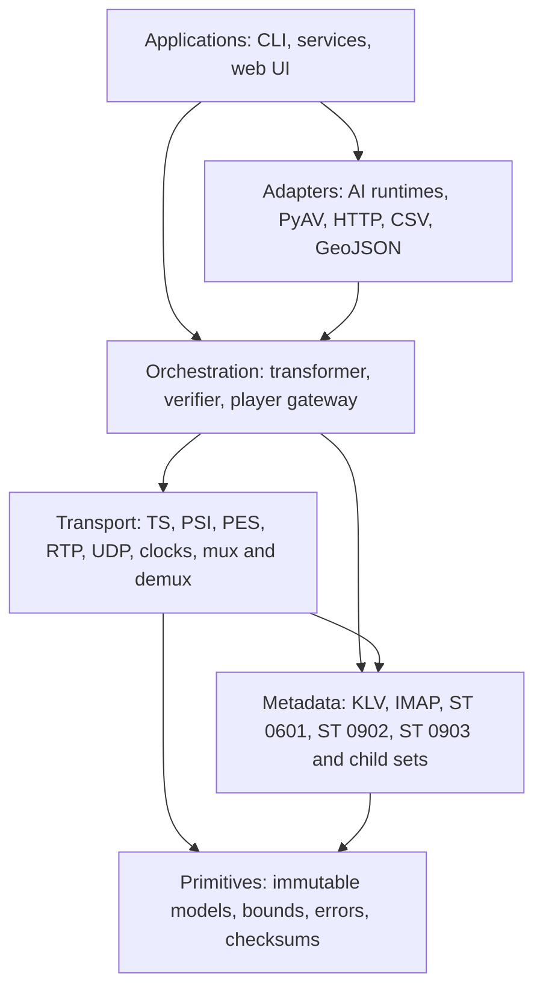
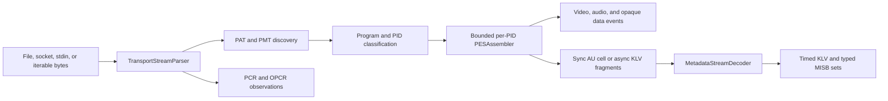
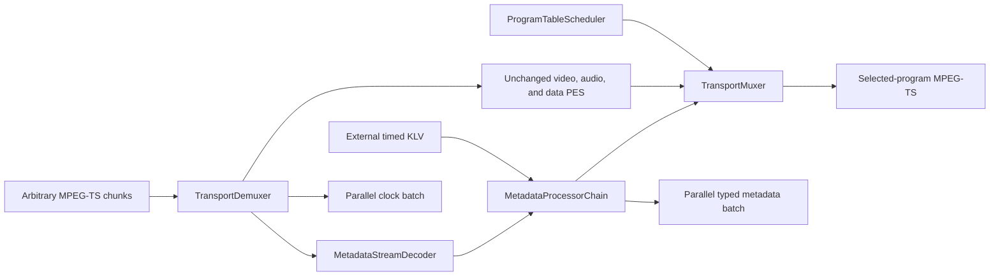
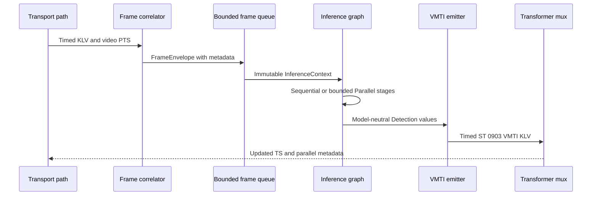
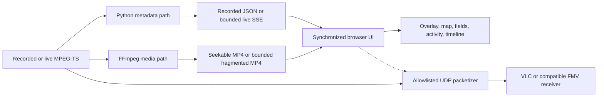

# System architecture

`stanag4609` is a protocol toolkit, not one monolithic player. Its center is a
dependency-free, incremental path from arbitrary transport bytes to typed timed
events and back to a valid MPEG-2 transport stream. The CLI, AI adapters,
exports, verifier, and web player are consumers of that core.

This guide explains which module to start with, where metadata or inference can
enter the stream, and which component owns timing, buffering, and optional
dependencies.

## Layers and dependency boundary

Dependencies point inward. Transport and MISB codecs do not import FFmpeg,
PyAV, NumPy, an inference runtime, or the browser player.

The pure-Python package has no required runtime dependencies. Codec and model
implementations remain explicit boundaries:

| Boundary | Why it is optional | Extra or executable |
| --- | --- | --- |
| Compressed video/audio decode | Codec implementations do not belong in the protocol core | `video-pyav`, `audio-pyav`, or FFmpeg |
| Local inference and tracking | Model weights and runtimes are application choices | `ai-ultralytics`, `ai-onnx` |
| Remote inference | Endpoint, batching, and availability are deployment choices | `ai-triton-http`, `ai-triton-grpc`, or the dependency-free HTTP adapter |
| Browser acceptance tests | Chromium is not needed by protocol users | `browser-test` |

See [ADR 0001](adr/0001-core-boundary.md) for the boundary decision.

## Module map

These are the implementation modules, not generic architecture placeholders.

| Area | Main modules | Responsibility | Produces |
| --- | --- | --- | --- |
| KLV primitives | `klv.ber`, `klv.key`, `klv.local_set`, `klv.stream` | BER lengths/OIDs, Universal Labels, Local Sets, incremental Universal KLV framing | `KLVPacket`, `LocalSet` |
| MISB codecs | `st0601`, `st0902`, `st0903`, `st0102`, other `st*` modules | Typed decode, canonical encode, lossless update, contextual validation | Typed sets, raw extensions, issues |
| TS framing | `transport.mpegts` | Incremental 188-byte packets, adaptation fields, PCR/OPCR, exact rebuild | `TransportPacket` |
| Program discovery | `transport.psi` | PSI assembly, PAT/PMT, KLVA descriptors and carriage | Program/stream descriptions |
| PES reconstruction | `transport.pes` | Bounded per-PID assembly and PTS/DTS parsing | `PESPacket` |
| Demultiplexing | `transport.demux` | Program selection and typed table, clock, video, audio, KLV, and data events | `DemuxEvent` values |
| Metadata carriage | `transport.metadata`, `transport.metadata_stream` | Synchronous AU cells, asynchronous fragments, timed KLV reconstruction | Timed metadata events |
| Processing | `transport.processor` | Explicit pass, drop, replace, and inject decisions | Transformed `TimedKLVPacket` values |
| Multiplexing | `transport.mux` | PAT/PMT/PES construction, continuity, KLVA packetization, table scheduling | Complete TS packets |
| Live transformation | `transport.transformer` | Compose demux, KLV decode, processors, and mux for one selected program | `TransformBatch` |
| Network carriage | `transport.udp`, `transport.rtp`, `transport.rtcp` | ST 1402 grouping, ST 0804/RFC 2250 RTP, reception/reorder, RTCP clock mapping | Network datagrams/events |
| Timing/conformance | `transport.pcr`, `transport.pts`, `transport.psi_timing`, `transport.std`, `transport.rate` | Rollover, cadence, buffer/delay models, shaping and restamping | Scheduled packets/issues |
| AI contracts | `sidecar.model`, `sidecar.pipeline`, `sidecar.queue`, `sidecar.correlation` | Frames/detections, sequential/parallel graphs, bounded queues, KLV correlation | Immutable inference contexts |
| AI adapters | `sidecar.ultralytics`, `sidecar.onnx`, `sidecar.triton`, `sidecar.http`, `sidecar.pyav` | Translate third-party frames, calls, and results | Core `Detection` values |
| VMTI bridge | `sidecar.vmti` | Convert conventional AI boxes into ST 0903 VTarget metadata | Embedded/standalone VMTI KLV |
| Verification | `verifier`, `verification_html`, codec/state validators | Compose structural, cadence, standards, producer-context, and policy checks | Terminal, JSON, HTML reports |
| Player | `player.timeline`, `player.live`, `player.server`, `player.udp_output` | Recorded indexes, live gateway, SSE/fMP4, web UI, controlled TS relay | Synchronized viewer outputs |
| Interchange | `csvio`, `csvmux`, `csvexport`, `geojson` | ArcGIS-style sidecars and parallel geospatial streams | TS, CSV, GeoJSON sequence |

The root `stanag4609` namespace re-exports the supported protocol surface.
Player and CLI implementation details remain in their subpackages.

## Read path: bytes to timed events

`TransportDemuxer` accepts arbitrary chunks; callers need not align reads to TS
packets, PES packets, access units, or KLV items.

PAT/PMT discovery is stateful because a receiver may join before a table and
tables may change version while it runs. Streams activate only after a valid,
current program map. Ambiguous MPTS requires an explicit program number.

The path preserves transport identity (program, PID, source offset, descriptors,
raw packet/PES bytes), media time (PTS/DTS/PCR), and metadata time. ST 0601 uses
MISP time, so UTC conversion is explicit rather than guessed. Read
[MISP and UTC timestamps](TIMESTAMPS.md) before correlating wall clocks.

## Transform path: demux, process, mux

`LiveTransportTransformer` is the high-level in-transit API. Each `feed()` call
returns everything made available by that input chunk; there is no hidden worker
queue.

Processors explicitly pass, drop, replace, or inject. Unchanged media PES and
packet layouts return to the muxer, so metadata-only work does not transcode
video/audio. Changed KLV is repacketized using the active synchronous or
asynchronous carriage. An additional KLVA stream can be declared for media that
did not already contain metadata.

The transformer emits one selected program. It may consume MPTS, but whole-MPTS
rewriting and cross-program scheduling are outside this API. See
[ADR 0002](adr/0002-live-transform-pipeline.md) and the
[live pipeline guide](LIVE_PIPELINE.md).

## AI sidecar path

Video decoding and inference run beside transport processing. Transport PTS is
authoritative; model completion time does not become presentation time.

`FrameEnvelope.pixels` has no prescribed runtime type: it may carry a PyAV
frame, NumPy array, GPU tensor, shared-memory reference, or application handle.
Adapters converge on `Detection`: persistent target ID, half-open pixel box,
confidence, label, optional algorithm, lifecycle status, and optional absolute
location. `sidecar.vmti` performs the explicit conversion to ST 0903 one-based
pixel positions.

`Sequential` exposes prior named outputs to later stages. `Parallel` gives each
branch the same immutable snapshot, bounds concurrency, and merges in declaration
order. `AsyncFrameQueue` requires an explicit overflow policy; inference stages
support timeouts and metrics. Dropping a complete frame under a declared policy
is distinct from dropping arbitrary TS bytes, which would corrupt the stream.

See [AI and VMTI sidecars](AI_SIDECARS.md) and the
[bring-your-own-adapter guide](ADAPTERS.md).

## Reference player path

The player is an example composition, not a core dependency. Recorded and live
media delivery differ, but use the same browser representation.

For live playback, `LivePlayerGateway.feed()` supplies both the incremental
metadata decoder and FFmpeg. FFmpeg backpressure propagates to the caller.
Fragment and metadata histories are bounded broadcasts, so viewers read the
same retained IDs rather than consuming one shared queue.

The UI can only enable the IP destination configured by the operator. It cannot
choose another address. Control calls require a random per-process token, trusted
Host, and same-origin behavior. The relay sends original TS, not the browser
transcode. See the [reference player guide](PLAYER.md).

## Verifier composition

`FMVVerifier` consumes the same parsers instead of maintaining a second protocol
stack. It combines evidence at five levels:

1. TS synchronization, continuity, adaptation fields, PSI, and PES.
2. Program inventory, media properties, descriptors, and KLVA carriage.
3. KLV framing, typed Local Sets, checksums, mandatory fields, and state.
4. PCR/PTS/table cadence, metadata buffer, and delay models.
5. Cross-item, child-standard, security-policy, and producer-supplied context.

Some facts are byte-verifiable; sensor truth, classification policy, conversion
history, and acquisition precision require caller evidence. Reports preserve
that distinction. See [verify and debug FMV](VERIFIER.md).

## Backpressure, bounds, and lifecycle

Long-running inputs make implicit buffering unsafe. Incremental parsers expose
maximum item, access-unit, PES, program, and stream counts. Core transformation
is synchronous and pull-driven unless the caller chooses an async boundary.
Async frame queues and browser histories are bounded and report loss/reset
conditions. `finish()` validates partial terminal state; `reset()` reports what
was discarded before a reconnect epoch.

A service can therefore choose policy at a real boundary: slow upstream, drop a
complete inference frame, restart an input epoch, or scale a worker. The library
does not silently turn overload into malformed TS or half a KLV item.

## Choosing an entry point

| Need | Start with |
| --- | --- |
| Inspect raw KLV | `KLVStreamParser` or `iter_klv` |
| Decode/update ST 0601 | `decode_uas_local_set`, `update_uas_local_set`, `encode_uas_local_set` |
| Inventory video/audio/KLV PIDs | `TransportDemuxer` |
| Change live KLV while preserving media | `LiveTransportTransformer` and `MetadataProcessorChain` |
| Inject externally produced VMTI | `VMTIMetadataEmitter` and `LiveTransportTransformer.emit_metadata()` |
| Compose local/remote AI | `InferenceStage`, `Sequential`, `Parallel` |
| Control frame pressure | `AsyncFrameQueue` and `FrameOverflowPolicy` |
| Create TS from media/metadata | `TransportMuxer`, or `stanag4609-mux-esri` for CSV |
| Send TS over UDP/RTP | `iter_udp_datagrams` or `RTPMPEG2TransportPacketizer` |
| Export parallel GIS data | `iter_geojson_feature_collections` or `iter_esri_metadata_rows` |
| Diagnose FMV | `FMVVerifier` or `stanag4609-verify` |
| Embed the reference viewer | `LivePlayerGateway` or `stanag4609-player` |

## Production gateway boundary

The repository provides protocol components and a hardened localhost reference
server. Production applications still own authentication, TLS, tenancy and
classification isolation, ingress/session protocols, durable storage, process
supervision, observability, GPU/model scheduling, multicast interfaces,
receiver discovery, and production viewer fan-out such as WebRTC/HLS/DASH.

Those concerns should wrap the core rather than fork its parsers. The same tested
KLV, timing, mutation, and mux behavior can then serve an edge process, cloud
gateway, CLI, or desktop application.
