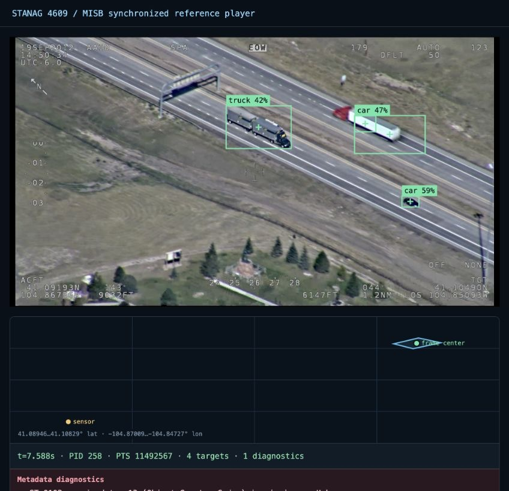

# Add AI detections as VMTI

This tutorial runs two model-neutral detector branches concurrently, fuses their
results, and encodes the detections as a timed ST 0601 packet containing ST 0903
VMTI. It needs no model framework or optional dependency.

```console
python examples/tutorials/ai_to_vmti.py
```

The deterministic example prints this actual result:

```text
PID=0x0120 PTS=900000 targets=[101, 202] KLV_bytes=429
```

The target IDs prove that both detector branches reached the ordered fusion
stage. The final byte count is a regression observation for this example, not a
fixed ST 0903 packet size.

## See it in the FMV player

Install the optional local-model runtime, then run YOLO11 against every
synchronized metadata sample in the checksum-pinned Esri `Truck.ts` fixture:

```console
pip install 'stanag4609[ai-ultralytics]'
```

```console
python examples/tutorials/ai_sidecar_ui.py \
  samples/private/esri-fmv/Truck.ts \
  --weights yolo11n.pt
```

The first run downloads the small YOLO11n weights. The server starts after
inference and prints the browser URL with an observed result summary:

```text
AI sidecar UI: http://127.0.0.1:8767/ model=yolo11n.pt detected_frames=488 detections=1155
```

Counts can change with model-runtime versions and inference hardware.

Open that URL, start playback, and seek through the video. The player keeps the
FMV telemetry, map, activity feed, and VMTI overlays synchronized.



*Actual browser capture using the pinned Esri `Truck.ts` fixture. The green
boxes are per-frame YOLO11n road-vehicle predictions encoded as ST 0903 VMTI
and decoded again by the production player adapter. The demo uses COCO car,
motorcycle, bus, and truck classes with a `0.35` confidence threshold. It is an
integration demonstration, not a claim about model accuracy.*

Use `--confidence`, `--image-size`, and `--device` to tune the demo. Replace the
weights or adapter for an application model; the VMTI encoding and player
boundary remain unchanged.

The earlier dependency-free example deliberately uses small deterministic
functions so the complete data contract is visible. Replace those functions
with an Ultralytics, ONNX
Runtime, Triton, HTTP, or application-specific adapter without changing the
pipeline or VMTI boundary.

## The processing graph

```python
graph = Sequential(
    Parallel(
        InferenceStage("vehicles", vehicle_detector, threaded=True),
        InferenceStage("people", person_service, timeout_seconds=0.2),
        max_concurrency=2,
    ),
    InferenceStage("fused", fuse),
)
completed = await graph.run(InferenceContext(frame))
```

Parallel results merge in declaration order, not completion order. Put dependent
fusion, tracking, or classification stages after the parallel group. In a live
system, place decoded frames in `AsyncFrameQueue` with an explicit overload
policy so slow inference cannot grow memory without bound.

## Preserve meaning in VMTI

Each emitted detection has a stable positive target ID, half-open pixel bounding
box, confidence, algorithm ID, and label. The example declares the algorithms
and maps `truck` and `person` to packet-scoped ST 0903 ontologies before calling
`VMTIMetadataEmitter`. This is preferable to shipping only an application label:
downstream FMV consumers receive standards-native provenance and meaning.

The emitter produces a `TimedKLVPacket` at the frame PTS. If the frame was
correlated with a source ST 0601 packet, unrelated and unknown wire fields are
preserved. Otherwise, as in this example, it creates a minimal timestamped
parent on the explicitly selected metadata PID.

## Insert the result in transit

```python
timed_klv = emitter(completed)
batch = transformer.emit_metadata(timed_klv, at=monotonic())
transport_sink.write(batch.transport)
```

The output PID must already exist or be declared with
`additional_metadata_stream` when constructing `LiveTransportTransformer`.
Use the same `batch.metadata` event for the operator UI or analytics feed; do
not parse the transformed bytes a second time merely to recover your own result.

## Bring a real model

- [AI sidecars](../AI_SIDECARS.md) documents queues, correlation, metrics, and
  the built-in Ultralytics, ONNX Runtime, Triton, and JSON/HTTP adapters.
- [`examples/ai_sidecar`](https://github.com/trane293/stanag4609/tree/main/examples/ai_sidecar)
  contains one executable example per adapter and concern.
- Keep preprocessing and model-output decoding in the adapter. Keep PTS,
  correlation, overload policy, and VMTI encoding in the stable library layer.

Model weights, service credentials, retries, and deployment policy are
intentionally not bundled with the protocol package.
