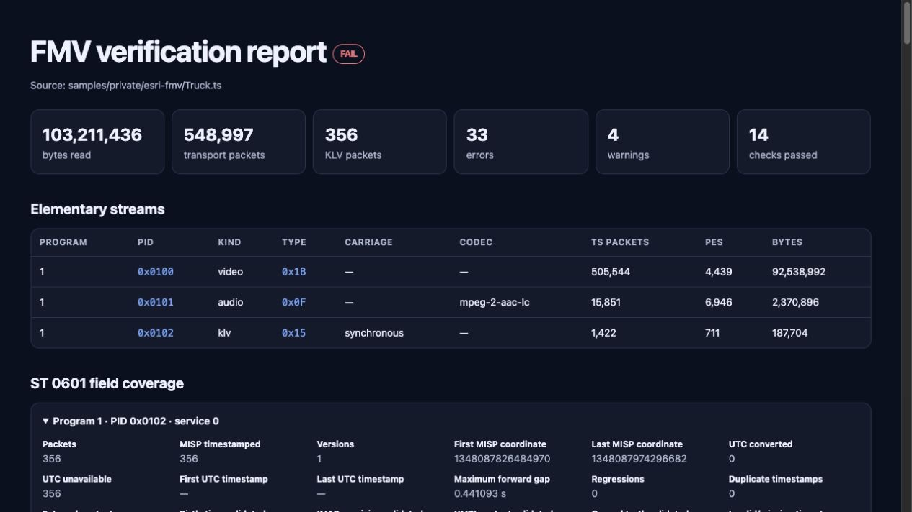
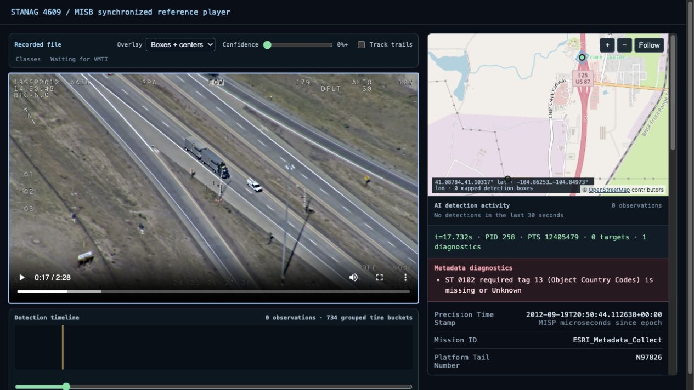

# Inspect and debug an FMV recording

This tutorial downloads the project's checksum-pinned public fixtures, inventories
their streams, explains conformance findings, and opens one in the reference
player. It requires FFmpeg for browser playback.

## Install the development checkout

```console
git clone git@github.com:trane293/stanag4609.git
cd stanag4609
python -m venv .venv
source .venv/bin/activate
python -m pip install -e '.[dev]'
python scripts/fetch_public_fixtures.py
```

The MPEG files are written under the ignored `samples/private/` directory.
They are not committed to Git. The fetcher validates the exact source archive or
file before installing it; see [public fixtures](../PUBLIC_FIXTURES.md) for the
recorded identities and expected contents.

## Verify structure and conformance

```console
stanag4609-verify "samples/private/ffmpeg-mpegts-klv/Day Flight.mpg"
stanag4609-verify "samples/private/esri-fmv/Truck.ts" --format html > truck-report.html
```

A non-zero result does not necessarily mean the file is unplayable. For example,
the daylight file has valid H.264, KLVA discovery, transport continuity, and ST
0601 checksums, but uses a deployed four-byte encoding for a field defined as two
bytes. `Truck.ts` is playable but omits a Metadata STD descriptor and has source
timing/sequence diagnostics. The verifier reports these facts instead of silently
weakening the selected profile.

Use the structural profile when the immediate question is whether the container
can be safely read:

```console
stanag4609-verify "samples/private/esri-fmv/Truck.ts" --profile structural
```

### Actual output: Esri Truck fixture

The following is an excerpt captured from the command above against the
checksum-pinned fixture (`SHA-256
8667276b2c2fb36baa089b00e3978f55893cacf6e0d8f6e6d480bb934747cc79`):

```text
FMV verification report
Source: samples/private/esri-fmv/Truck.ts
Result: FAIL
Input: 103211436 bytes, 548997 TS packets, 1 program(s)
Metadata: 356 KLV packet(s), 356 ST 0601, 0 ST 0903, 0 unknown
VMTI targets: 0 observation(s), 0 stream-scoped unique ID(s)

Streams:
  program 1 PID 0x0100 video: stream_type=0x1B, PES=4439, ST0604=0/4439 access units, 1920x1080 Baseline Level 4.1 progressive
  program 1 PID 0x0101 audio: stream_type=0x0F, PES=6946, mpeg-2-aac-lc, frames=6946, 48000 Hz, 2 channel(s)
  program 1 PID 0x0102 klv: stream_type=0x15, PES=711, synchronous

ST 0601 services:
  program 1 PID 0x0102 service 0: packets=356, tags=37 known/0 unknown, versions=[1]
    MISP Item 2: first=1348087826484970, last=1348087974296682; UTC converted=0, unavailable=356

Summary: 33 error(s), 4 warning(s), 14 passed, 1 not applicable
```

This is an expected `FAIL`, not a broken tutorial: the public recording is
playable and structurally useful. The expanded verifier now reports its missing
Metadata STD descriptor and embedded ST 0604 timestamps, malformed or absent
ST 0902 fields, non-profile AVC signalling, PCR cadence, metadata sequence, and
decoder-delay findings. Repeated packet-level occurrences are aggregated under
stable finding codes, which is why the summary counts findings rather than bad
packets. Generate the self-contained HTML form with the earlier `--format html`
command:



*Captured from the real `Truck.ts` fixture; the visible failure is the expected
diagnostic result for this independently authored sample.*

## View synchronized video and metadata

```console
stanag4609-player "samples/private/esri-fmv/Truck.ts"
```

The command prepares a seekable browser asset, then opens a localhost server.
The UI follows media PTS rather than packet arrival time and displays the current
Report-on-Change state, map geometry, VMTI overlays, and sample diagnostics. Stop
it with Ctrl-C.



*The bundled player at 17.93 seconds: H.264 video, current ST 0601 fields,
frame-center geometry on OpenStreetMap, and metadata diagnostics all derive
from the same transport and playhead. This source has no VMTI, so detection
controls and the timeline correctly show zero observations.*

## Export the same timeline

```console
stanag4609-export-geojson "samples/private/esri-fmv/Truck.ts" truck.geojsonl
stanag4609-export-esri "samples/private/esri-fmv/Truck.ts" truck.csv
```

GeoJSON is emitted as one line per metadata update so a GIS adapter can consume
it incrementally. CSV provides the familiar ArcGIS FMV sidecar boundary. Neither
export changes the source file.

## Automate this in Python

```python
from stanag4609.player import scan_transport_file
from stanag4609.verifier import verify_fmv_file

report = verify_fmv_file("mission.ts")
if report.errors:
    for finding in report.findings:
        print(finding.status.value, finding.code, finding.message)

timeline = scan_transport_file("mission.ts")
for sample in timeline.samples:
    publish(sample.time_seconds, sample.fields, sample.geospatial)
```

Use the verifier for acceptance policy and the timeline for presentation. Do not
treat a successful player scan as a conformance result.
