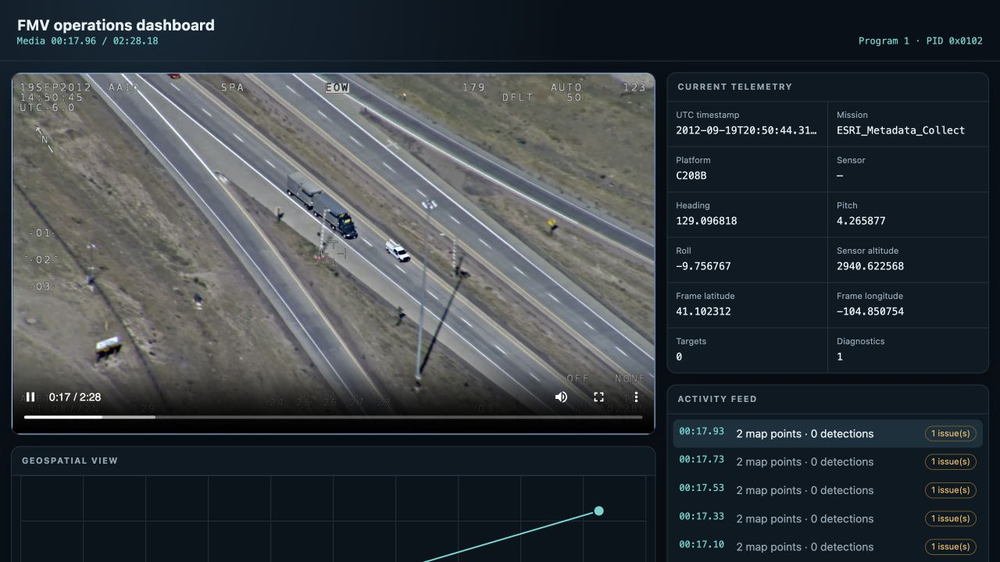

# Build a video, map, and activity dashboard

The repository includes a dependency-free custom web application that displays
prepared video, live-at-playhead geospatial geometry, decoded telemetry, and an
activity feed. It demonstrates the public player assets rather than embedding
private browser APIs.

```console
python examples/web_dashboard/server.py \
  "samples/private/esri-fmv/Truck.ts"
```

FFmpeg first prepares `media.mp4`; the library independently creates
`timeline.json` from the original transport. The temporary directory is served
only on `127.0.0.1:8766` by default and is removed at shutdown.

The running tutorial prints the URL before serving:

```text
FMV dashboard: http://127.0.0.1:8766/
```



*Actual output from the checksum-pinned Esri `Truck.ts` fixture at media time
17.96 seconds. Program 1 / PID `0x0102` drives both the current telemetry and
activity feed; the map plots the current sensor and frame-center coordinates.*

## What the browser consumes

The page uses only three assets:

- `media.mp4`, a browser-compatible representation of the original media;
- `timeline.json`, ordered samples keyed by media-relative time; and
- `index.html`, the application renderer.

On every video time update, the page selects the newest sample whose
`time_seconds` is not in the future. That one sample drives the map, telemetry,
diagnostics, VMTI activity, and overlays, preventing independently drifting UI
panels. The source implementation is in
[`examples/web_dashboard/index.html`](https://github.com/trane293/stanag4609/blob/main/examples/web_dashboard/index.html).

The bundled `stanag4609-player` adds a pannable OpenStreetMap baselayer, mapped
frame footprints and VMTI boxes, a grouped 30-second activity feed, and an
interactive detection timeline. The timeline aggregates observations into no
more than one time bucket per canvas pixel (and never more than 2,048), so a
mission with millions of observations does not become millions of DOM nodes.
Within each bucket it stacks the five most prevalent classes plus `other`, and
uses logarithmic height scaling so short bursts remain legible beside dense
periods. Hover a bucket for its precise interval and class counts; click, drag,
or use the keyboard to seek.
Use `http://127.0.0.1:8765/?basemap=off` when testing offline. The public OSM
tiles are appropriate for this low-volume reference UI, not an unrestricted
production tile backend.

## Use the asset API in another backend

```python
from stanag4609.player.server import prepare_player_assets

assets = prepare_player_assets("mission.ts", "build/fmv-player")
print(assets.media, assets.timeline, assets.root)
```

Serve the returned files with normal HTTP range support. A FastAPI, Django,
Flask, Starlette, Node, or Rust service can use the same stable JSON boundary.
For long recordings, use the included incremental mode or page/index the
timeline by time instead of returning it as one response. The reference server's
`/metadata/summary` endpoint returns a sparse full-mission overview with exact
totals and bounded heavy-hitter labels; `/metadata/events` then supplies the
detailed samples around the playhead.

The bundled reference player also exposes the same samples incrementally:

```console
stanag4609-player mission.ts --stream-metadata
```

Its `/metadata/events` SSE endpoint sends current state at the requested
playhead and then paces future samples against media time. The browser holds at
most 512 samples, restarts from the playhead after seeking, fetches one effective
sample for paused scrubs, and accounts for playback-rate changes. A sparse
2,048-bin overview keeps the full recording visible while detailed memory stays
bounded. This is directly useful as a side-channel protocol example even though
the prepared MP4 is not a live media gateway.

## Move from recorded to live

The example prepares the whole file, so it is deterministic and seekable but is
not a low-latency transport. A live deployment keeps two synchronized paths:

```text
MPEG-TS -> transform/remux -> WebRTC, MSE, or HLS gateway -> video element
                 |
                 +-> bounded PTS/UTC metadata feed -> map, overlay, activity UI
```

Carry program, PID, PTS/UTC, discontinuity, and sequence identity over the side
channel. Browser arrival time is not media time. Apply authentication,
authorization, TLS, origin policy, request limits, and audit logging in the web
application or gateway; the tutorial server is localhost development tooling.

See [web clients](../WEB_CLIENTS.md) for rendering rules and
[live transforms](../LIVE_PIPELINE.md) for the incremental transport path.
